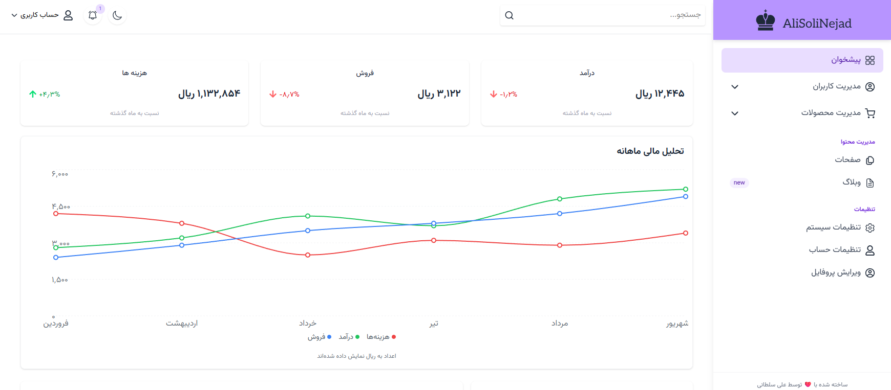

<!-- Dashboard Project -->
# 📊 Admin Shop Dashboard (React, Tailwind CSS)

A **Single Page Application (SPA)** admin dashboard built with `React`&`Tailwind`.</br> This responsive and modern control panel allows administrators to manage users, products, categories, inventory, and system settings, all in one place. It also provides statistical insights with charts and supports local data storage for faster operations.

[](public/preview1.png)  


## ✨ Features

- 👥 **User management**: view and edit user profiles & roles  
- 📦 **Product management**: add, edit, categorize, and update stock  
- 📂 **Category management**: organize products into categories and subcategories  
- 📊 **Statistical overview**: display sales, users, and product data with charts  
- 🌗 **Theme toggle**: switch between dark and light mode  
- ⚙️ **System settings**: configure global panel preferences  
- 🔑 **Account settings**: update personal account details  
- 💾 **IndexedDB support** for local data storage and fast access

---
## 💻 Installation:
>#### Clone the project with:
```
git clone https://github.com/alisoltaninejad/Admin-Dashboard
```
> run this commands:
```
npm i
npm run dev
```
